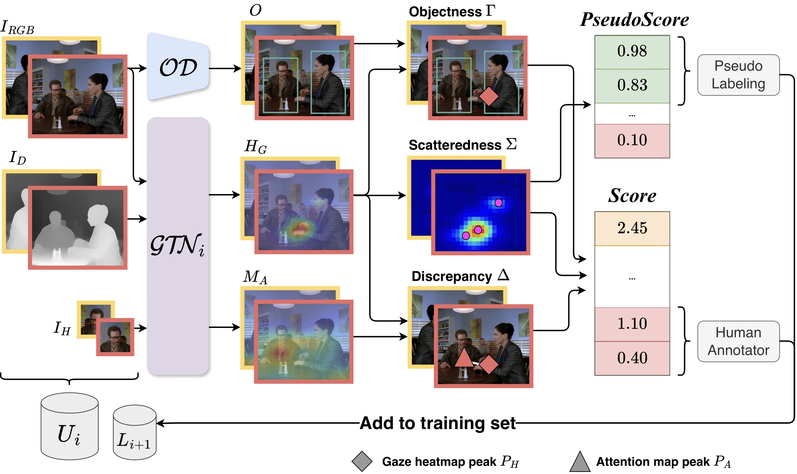

# AL-GTD: Deep Active Learning for Gaze Target Detection



## Setup
```bash
# clone project
git clone https://github.com/francescotonini/al-gtd
cd al-gtd

# [OPTIONAL] create virtualenv
pyenv virtualenv 3.10.14 algtd
pyenv local algtd

# install requirements
pip install -r requirements.txt

# link datasets to data folder
ln -s /path/to/gazefollow_extended data

# split the training set for active learning
python scripts/gazefollow_train_split.py --dataset_dir data/gazefollow_extended
```

## Run
```bash
python src/main.py
```

## Cite us
```latex
@inproceedings{tonini2024gtd,
    title={AL-GTD: Deep Active Learning for Gaze Target Detection},
    author={Tonini, Francesco and Dall'Asen, Nicola and Vaquero, Lorenzo and Beyan, Cigdem and Ricci, Elisa},
    booktitle={Proceedings of the 32nd ACM International Conference on Multimedia},
    pages={2360--2369},
    year={2024}
}
```